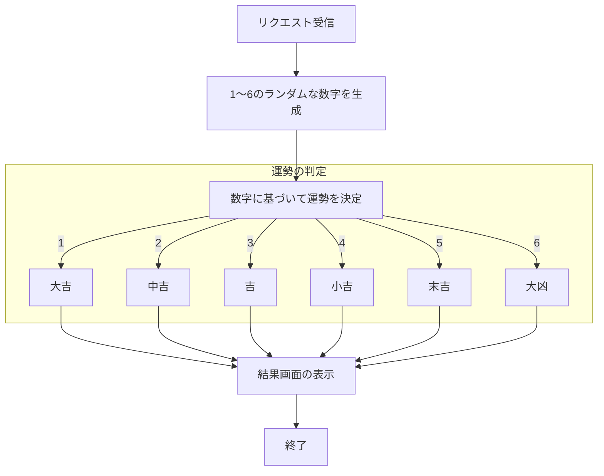
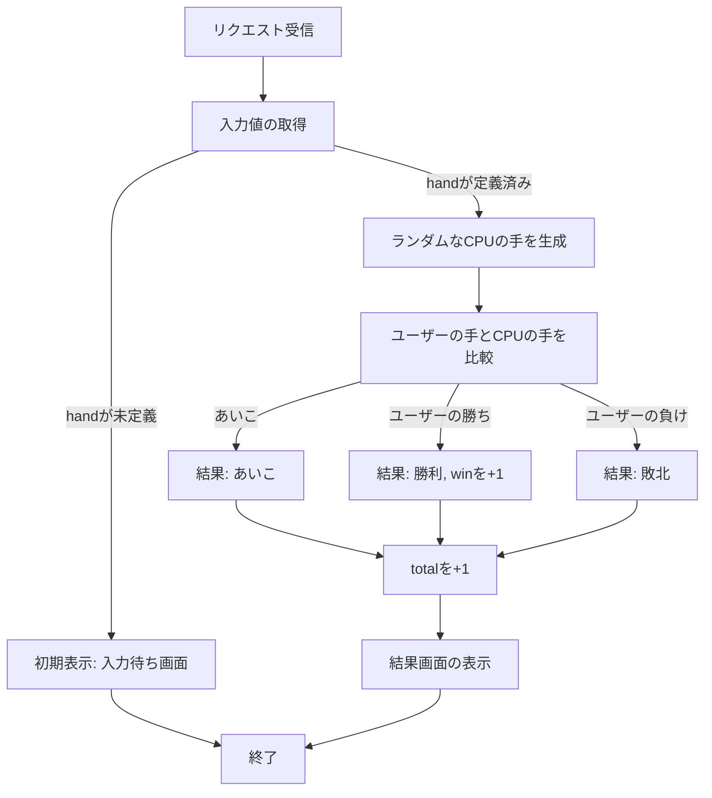
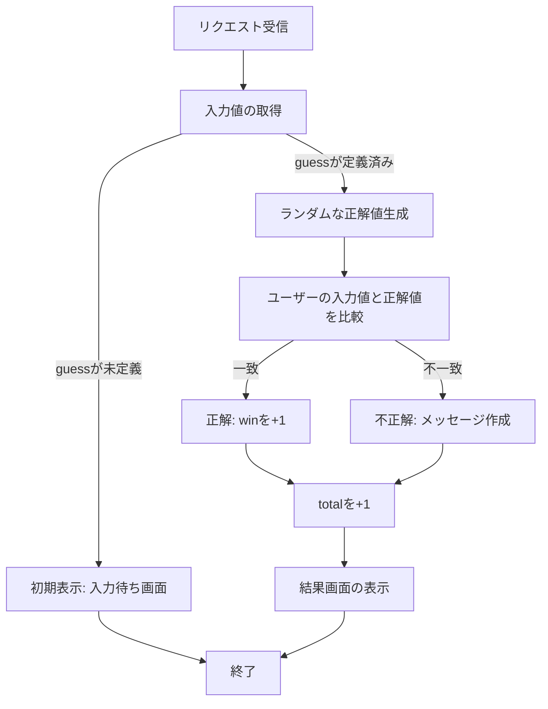
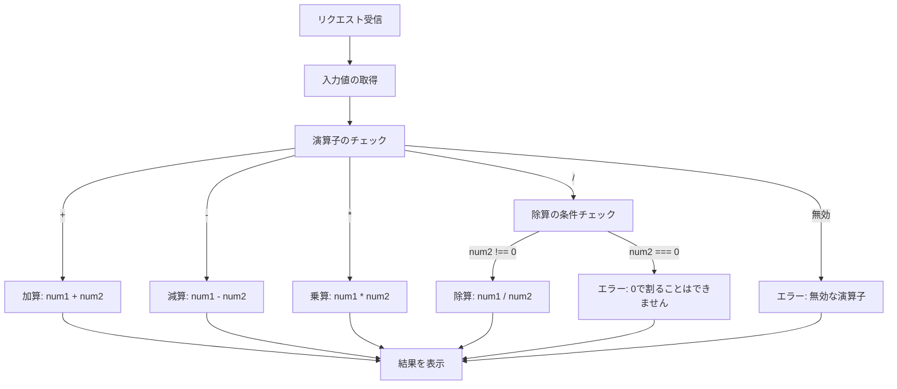

# app5.js
## このプログラムについて
## ファイル一覧
ファイル名 | 説明
-|-
app5.js | プログラム本体
public/janken.html | じゃんけんの開始画面
public/kazuate.html | 数当ての開始画面
public/keisan.html | 計算の開始画面
views/luck.ejs | おみくじのテンプレートファイル
views/show.ejs | 挨拶のテンプレートファイル
views/icon.ejs | 画像表示のテンプレートファイル
views/kazuate.ejs | 数当てのテンプレートファイル
views/keisan.ejs | 計算のテンプレートファイル
views/kazuate.ejs | じゃんけんのテンプレートファイル

## 起動方法
リポジトリのクローン Gitを使用してプロジェクトをクローンする
```javascript
git clone <リポジトリのURL>
cd <プロジェクトディレクトリ名>
```
必要なNode.jsパッケージをインストールする

```javascript
npm install
```

サーバーを起動する

```javascript
node app5.js
```

サーバーが起動したら、以下のURLにアクセスする
http://localhost:8080/

## Gitによる管理


```javascript
git add .
git commit -m "変更内容を簡潔に記述"
git push
```
ここでGithubのアクセストークンを入力する

## 各機能の説明と使用手順
1. 挨拶

/hello1: 変数で指定した2つの挨拶メッセージ（Hello world, Bon jour）を画面に表示する
/hello2: ハードコーディングされたメッセージを表示する

使用方法
以下のURLにアクセスする
http://localhost:8080/hello1
http://localhost:8080/hello2


2. 画像

Appleロゴ画像を表示する

使用方法
以下のリンクにアクセスする

http://localhost:8080/icon

3. おみくじ

ランダムに生成した数字によって、ユーザーの運勢を診断する．診断結果は 大吉 または 中吉 などになる

使用方法
以下のURLにアクセスする
http://localhost:8080/luck



4. じゃんけん

ユーザーとコンピュータがじゃんけんを行う．結果（勝ち・負け・あいこ）と勝利数・対戦数を表示する
hand: ユーザーの手（グー、チョキ、パー）
win: 勝利数（初回は0を指定）
total: 総対戦数（初回は0を指定）


使用方法
以下のリンクにアクセスする

http://localhost:8080/public/janken.html

ここでグー・チョキ・パーを選び送信ボタンを押すことで結果と勝利数・対戦数が表示される

フローチャート



5. 数当て

1～10のランダムな数字を生成し，ユーザーが入力した数字と一致するかを判定する
guess: ユーザーが予想する数字（1～10の範囲）
win: 勝利数（初回は0を指定）
total: 総挑戦数（初回は0を指定）


使用方法
以下のリンクにアクセスする

http://localhost:8080/public/kazuate.html

1から10までの数字を入力し，コンピュータと一致するか表示する

フローチャート



6. 計算

ユーザーが入力した2つの数値と演算子（+, -, *, /）を受け取り，結果を返す
num1: 最初の数値
num2: 次の数値
operator: 演算子（+, -, *, /）


使用方法
以下のリンクにアクセスする

http://localhost:8080/public/keisan.html

数値を2つと演算子を入力し，演算結果が表示される．もし無効な演算子やゼロ除算が指定された場合，エラーメッセージが表示される

フローチャート



